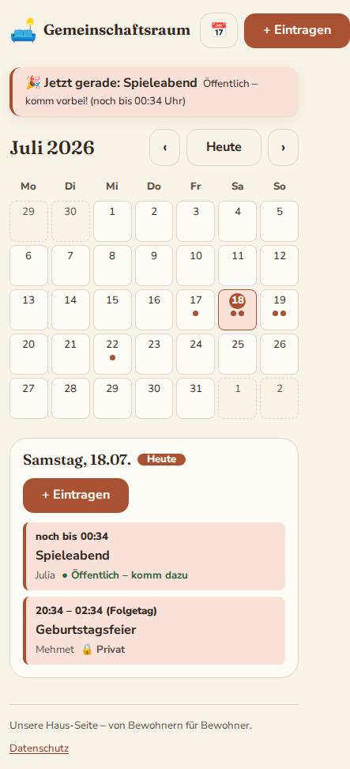
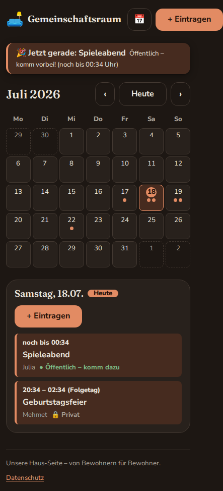
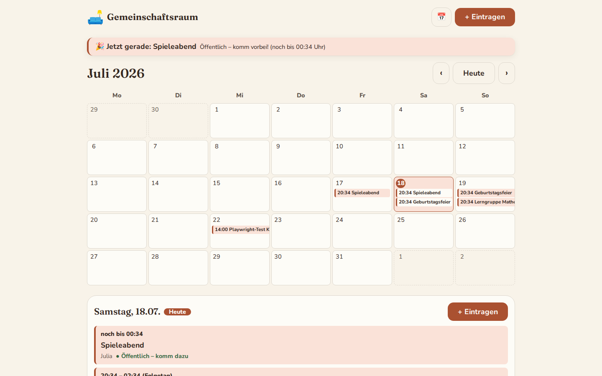
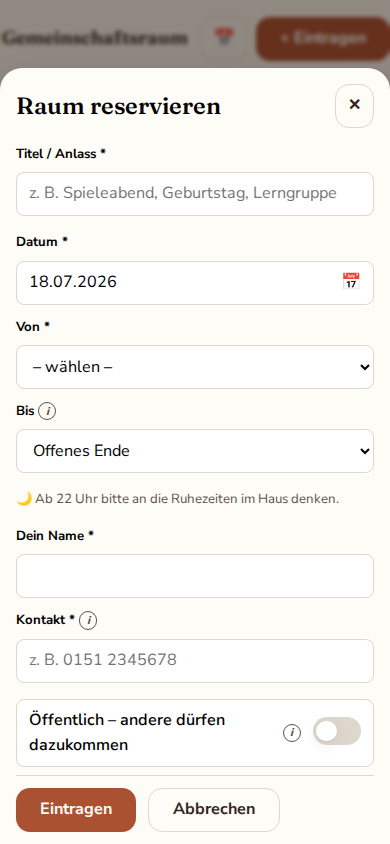

# Gemeinschaftsraum-Belegungsplan

Belegungsplan für den Gemeinschaftsraum unseres Studentenwohnheims in Regensburg.
Bewohner sehen auf einen Blick, wann der Raum frei ist, tragen sich selbst ein
(ohne Account) und können ihren Eintrag über einen geheimen Link ändern oder löschen.
Die ganze Seite liegt hinter einem gemeinsamen Haus-Passwort.

| Mobil (hell)                                  | Mobil (dunkel)                                            | Desktop                                           | Eintragen-Dialog                           |
| --------------------------------------------- | --------------------------------------------------------- | ------------------------------------------------- | ------------------------------------------ |
|  |  |  |  |

**Stack:** SvelteKit (Svelte 5, TypeScript, `adapter-node`) · SQLite (`better-sqlite3` + Drizzle)
· ein einzelner Node-Prozess, keine externen Dienste.

---

## Betrieb (für den Hoster)

### Voraussetzungen

- **Node.js 22+** (getestet mit 22 und 24) — oder Docker, siehe unten
- ~128–256 MB RAM, minimaler CPU-Bedarf; SQLite-Datei wächst im niedrigen MB-Bereich

### ENV-Variablen

Alle Variablen stehen mit Beispielwerten in [`.env.example`](.env.example):

| Variable         | Pflicht   | Bedeutung                                                                                  |
| ---------------- | --------- | ------------------------------------------------------------------------------------------ |
| `HAUS_PASSWORT`  | ja        | Gemeinsames Passwort für alle Bewohner (kommt in die WhatsApp-Gruppe)                      |
| `SESSION_SECRET` | ja        | Signiert das Login-Cookie, min. 32 Zeichen: `openssl rand -hex 32`                         |
| `DATABASE_PATH`  | ja        | Pfad zur SQLite-Datei, z. B. `data/gemeinschaftsraum.db` (Verzeichnis wird angelegt)       |
| `ORIGIN`         | ja (Prod) | Öffentliche URL, z. B. `https://raum.example.de` — nötig für den CSRF-Schutz der Formulare |
| `PORT`           | nein      | Default `3000`                                                                             |

Fehlt eine Pflicht-Variable, bricht der Start mit einer klaren Fehlermeldung ab.

### Bauen & Starten (ohne Docker)

```bash
npm ci
npm run build
HAUS_PASSWORT=… SESSION_SECRET=… DATABASE_PATH=data/gemeinschaftsraum.db ORIGIN=https://… node build
```

Migrationen laufen automatisch beim Start (Ordner `drizzle/` muss neben dem Prozess liegen).
Alte Einträge (Ende > 30 Tage her) werden beim Start und danach täglich automatisch gelöscht —
kein Cron nötig.

### Docker (Angebot, gern auch eigenes Packaging)

```bash
docker compose up -d --build   # nutzt compose.yml, Volume für /app/data
```

### Reverse Proxy & TLS

Die App erwartet, hinter einem Reverse Proxy mit **TLS** zu laufen (Caddy/nginx/Traefik).
Das Login-Cookie ist `Secure` — ohne HTTPS funktioniert der Login in Produktion nicht.
`ORIGIN` muss auf die öffentliche URL zeigen. HSTS bitte am Proxy setzen; alle übrigen
Security-Header (CSP, `X-Content-Type-Options`, …) setzt die App selbst.

### Healthcheck

`GET /healthz` → `{"status":"ok"}` (ohne Passwort erreichbar, prüft auch die DB).

### Backup & Notfall-Eingriffe

- **Backup = eine Datei kopieren:** die SQLite-Datei aus `DATABASE_PATH`
  (bei WAL-Modus am saubersten per `sqlite3 gemeinschaftsraum.db ".backup backup.db"`).
- Es gibt **kein Admin-Panel.** Falls mal ein Eintrag von Hand weg muss:
  `sqlite3 data/gemeinschaftsraum.db "DELETE FROM bookings WHERE id = …;"`

---

## Entwicklung

```bash
cp .env.example .env   # Werte anpassen
npm install
npm run dev            # http://localhost:5173
```

| Befehl                           | Zweck                                                       |
| -------------------------------- | ----------------------------------------------------------- |
| `npm run test:unit -- --run`     | Vitest (Überlappung, Validierung, Tokens, Session, Cleanup) |
| `npm run test:e2e`               | Playwright-Flows inkl. A11y-Checks (baut Prod-Build)        |
| `npm run lint` / `npm run check` | Prettier + ESLint / svelte-check                            |
| `npm run db:generate`            | Neue Drizzle-Migration nach Schema-Änderung                 |

CI (GitHub Actions) fährt lint → check → unit → build und die E2E-Suite bei jedem Push.

## Wie es funktioniert

- **Kein Account-System:** Beim Eintragen wird ein geheimer Bearbeitungs-Link erzeugt
  (32-Byte-Token, in der DB nur als SHA-256-Hash). Wer den Link hat, darf ändern/löschen.
- **Überlappungen** verhindert der Server in einer Transaktion; die Meldung nennt den
  störenden Eintrag. Buchungen über Mitternacht sind ein Eintrag mit Ende am Folgetag.
- **Regeln:** max. 3 Monate im Voraus, max. 12 h pro Eintrag, nicht in der Vergangenheit.
- **Datensparsamkeit:** Einträge werden 30 Tage nach ihrem Ende automatisch gelöscht.
  Kein Tracking, keine externen CDNs/Fonts, ein einziges (Login-)Cookie. Details:
  `/datenschutz`.
- **Rate-Limits** (in-memory): Login 10 Versuche / 15 min pro IP, Schreibaktionen 30 / min.
- **Bedienung:** Startseite ist ein Monatskalender mit Tages-Panel. Ein Tipp auf einen
  freien (künftigen) Tag öffnet direkt den Eintragen-Dialog mit vorbefülltem Datum,
  Einträge öffnen sich als Detail-Dialog; ohne JavaScript fällt alles auf eigene Seiten
  zurück (Progressive Enhancement). Datum/Uhrzeit sind eigene deutsche Picker
  (30-min-Raster); die Endzeit ist optional – ohne sie gilt „offenes Ende" (6 h
  reserviert). Fehler wie Belegungskonflikte erscheinen als Toast.
- **Extras:** „Jetzt gerade"-Banner (läuft etwas? wann ist der Raum wieder frei?),
  Ruhezeiten-Hinweis im Formular und ein read-only **Kalender-Abo**
  (`/kalender.ics?token=…`, Link auf der Startseite — enthält nur Titel und Zeiten,
  keine Kontaktdaten). Hell- und Dunkel-Theme folgen dem System.

## Offene Punkte

- **Impressum:** Für eine private, nicht geschäftsmäßige Haus-Seite vermutlich nicht
  nötig (§ 5 DDG greift bei geschäftsmäßigen Diensten). Bewusst offen gelassen —
  falls die Seite mal öffentlich verlinkt wird, nochmal prüfen.
- `npm audit` meldet Findings ausschließlich in `drizzle-kit` (Dev-Tooling, esbuild-
  Dev-Server) — kein Runtime-Risiko, wird mit einem späteren drizzle-kit-Update verschwinden.
